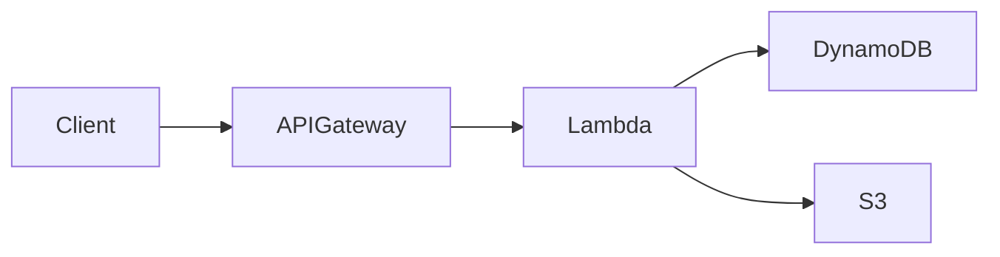

## Introduction

The serverless revolution has fundamentally transformed how we architect and deploy applications. By abstracting away infrastructure management, serverless computing enables developers to focus exclusively on business logic while cloud providers handle scaling, patching, and resource provisioning. AWS Lambda, Azure Functions, and Google Cloud Functions have made it possible to build applications that scale from zero to millions of requests without managing a single server.

However, building production-ready serverless applications requires more than just writing functions. Successful serverless architectures demand a deep understanding of event-driven design patterns, function composition strategies, and performance optimization techniques that differ significantly from traditional server-based approaches.


## Understanding Serverless Architecture: Core Concepts

Serverless computing represents a paradigm shift from traditional infrastructure management. At its core, serverless architecture means your code runs in ephemeral containers that spin up on demand, execute your function, and terminate immediately after. You pay only for the compute time consumed during execution, not for idle servers.

The serverless model introduces several fundamental concepts that shape architectural decisions:

**Event-Driven Execution**: Functions are triggered by events—HTTP requests, database changes, queue messages, file uploads, or scheduled timers. This event-driven nature encourages reactive programming patterns where components respond to state changes rather than polling for updates.

**Statelessness**: Each function invocation starts with a clean slate. There's no persistent memory between requests, which forces developers to externalize state to databases, caches, or storage services. This constraint improves scalability but requires careful state management strategies.

**Function as a Unit of Deployment**: Individual functions become the deployment unit, enabling granular updates and rollbacks. This micro-deployment model allows teams to iterate quickly on specific features without affecting the entire application.

**Managed Services Integration**: Serverless architectures leverage managed services for databases, messaging, storage, and authentication. The cloud provider handles operational concerns like backups, scaling, and security patches.


## Architecture and Design Patterns

### The API Gateway Pattern

The most common serverless pattern uses API Gateway as the entry point for HTTP requests. API Gateway handles authentication, rate limiting, request validation, and routing before forwarding requests to Lambda functions.



This pattern works well for REST APIs and microservices. API Gateway supports multiple endpoint types, including REST APIs with full features and HTTP APIs optimized for lower latency and cost.

### The Event Processing Pattern

Event processing patterns handle streams of events from various sources. Common implementations include:

**S3 Event Processing**: Trigger functions when files are uploaded to S3, enabling automatic image resizing, data validation, or ETL pipeline processing.

**DynamoDB Streams**: React to database changes in real-time, maintaining search indexes, triggering notifications, or aggregating analytics data.

**SQS/SNS Integration**: Process messages from queues for reliable, asynchronous task execution with built-in retry mechanisms and dead-letter queues.

### The Fan-Out Pattern

The fan-out pattern distributes work across multiple functions in parallel. A single event triggers an orchestrator function that fans out work to multiple worker functions, then aggregates results.

```javascript
// Orchestrator function
exports.handler = async (event) => {
  const tasks = splitIntoChunks(event.data);
  
  // Fan out to worker functions
  const results = await Promise.all(
    tasks.map(task => invokeLambda('worker-function', task))
  );
  
  // Aggregate results
  return aggregateResults(results);
};
```

### The Saga Pattern

For distributed transactions spanning multiple services, the saga pattern coordinates a sequence of local transactions with compensating actions for rollback scenarios.


## Step-by-Step Implementation

Let's build a production-ready serverless API with AWS Lambda, API Gateway, and DynamoDB.

### Setting Up the Project Structure

```bash
mkdir serverless-api && cd serverless-api
npm init -y
npm install aws-sdk uuid
npm install -D serverless serverless-offline
```

### Serverless Framework Configuration

```yaml
# serverless.yml
service: serverless-api

provider:
  name: aws
  runtime: nodejs18.x
  stage: ${opt:stage, 'dev'}
  region: ${opt:region, 'us-east-1'}
  memorySize: 256
  timeout: 30
  environment:
    TABLE_NAME: ${self:service}-${self:provider.stage}
  iam:
    role:
      statements:
        - Effect: Allow
          Action:
            - dynamodb:PutItem
            - dynamodb:GetItem
            - dynamodb:Scan
            - dynamodb:UpdateItem
            - dynamodb:DeleteItem
          Resource: arn:aws:dynamodb:${self:provider.region}:*:table/${self:provider.environment.TABLE_NAME}

functions:
  create:
    handler: src/handlers/create.handler
    events:
      - http:
          path: /items
          method: post
          cors: true
  
  get:
    handler: src/handlers/get.handler
    events:
      - http:
          path: /items/{id}
          method: get
          cors: true
  
  list:
    handler: src/handlers/list.handler
    events:
      - http:
          path: /items
          method: get
          cors: true
  
  update:
    handler: src/handlers/update.handler
    events:
      - http:
          path: /items/{id}
          method: put
          cors: true
  
  delete:
    handler: src/handlers/delete.handler
    events:
      - http:
          path: /items/{id}
          method: delete
          cors: true

resources:
  Resources:
    ItemsTable:
      Type: AWS::DynamoDB::Table
      Properties:
        TableName: ${self:provider.environment.TABLE_NAME}
        BillingMode: PAY_PER_REQUEST
        AttributeDefinitions:
          - AttributeName: id
            AttributeType: S
        KeySchema:
          - AttributeName: id
            KeyType: HASH
```

### Function Implementation

```javascript
// src/handlers/create.js
const AWS = require('aws-sdk');
const { v4: uuidv4 } = require('uuid');

const dynamoDB = new AWS.DynamoDB.DocumentClient();

exports.handler = async (event) => {
  try {
    const body = JSON.parse(event.body);
    const id = uuidv4();
    const timestamp = new Date().toISOString();
    
    const item = {
      id,
      ...body,
      createdAt: timestamp,
      updatedAt: timestamp
    };
    
    await dynamoDB.put({
      TableName: process.env.TABLE_NAME,
      Item: item
    }).promise();
    
    return {
      statusCode: 201,
      headers: {
        'Content-Type': 'application/json',
        'Access-Control-Allow-Origin': '*'
      },
      body: JSON.stringify(item)
    };
  } catch (error) {
    console.error('Create error:', error);
    return {
      statusCode: 500,
      body: JSON.stringify({ error: 'Internal server error' })
    };
  }
};
```

### Middleware and Shared Utilities

```javascript
// src/utils/middleware.js
const middy = require('@middy/core');
const httpJsonBodyParser = require('@middy/http-json-body-parser');
const httpErrorHandler = require('@middy/http-error-handler');
const validator = require('@middy/validator');

const createMiddleware = (handler, schema) => {
  return middy(handler)
    .use(httpJsonBodyParser())
    .use(validator({ inputSchema: schema }))
    .use(httpErrorHandler());
};

module.exports = { createMiddleware };
```

### Deployment and Monitoring

```bash
# Deploy to development
serverless deploy --stage dev

# Deploy to production
serverless deploy --stage prod

# View logs
serverless logs -f create --stage prod --tail

# Remove service
serverless remove --stage dev
```

## Real-World Use Cases and Case Studies

### E-Commerce Order Processing

Modern e-commerce platforms use serverless architectures to handle order processing workflows. When a customer places an order, API Gateway triggers a Lambda function that validates the order, reserves inventory in DynamoDB, processes payment through Stripe, and sends confirmation emails via SES.

The serverless model naturally handles traffic spikes during sales events. Black Friday traffic surges automatically scale Lambda functions from hundreds to thousands of concurrent executions without manual intervention or pre-provisioned capacity.

### Image Processing Pipeline

Media companies implement serverless image processing pipelines that automatically resize, optimize, and watermark uploaded images. S3 triggers initiate Lambda functions that process images in parallel, generate thumbnails in multiple sizes, and store results in separate buckets.

Netflix uses this pattern to process millions of video thumbnails, automatically generating region-specific artwork that improves viewer engagement. The pay-per-invocation model makes processing millions of images cost-effective compared to maintaining dedicated processing servers.

### Real-Time Analytics

Financial institutions leverage serverless architectures for real-time fraud detection. Transaction events stream through Kinesis, triggering Lambda functions that apply machine learning models, check against fraud rules, and flag suspicious activities within milliseconds.

Capital One processes millions of daily transactions using serverless functions, achieving sub-second fraud detection while maintaining costs proportional to actual transaction volumes rather than peak capacity.

### IoT Data Processing

Smart city implementations use serverless architectures to process sensor data from thousands of IoT devices. Temperature, traffic, and air quality sensors publish data to IoT Core, triggering Lambda functions that aggregate readings, trigger alerts, and update dashboards in real-time.

## Best Practices for Production

1. **Minimize Cold Starts**: Keep function packages small by removing unused dependencies. Use provisioned concurrency for latency-sensitive endpoints. Initialize SDK clients and database connections outside the handler to reuse across invocations.

2. **Implement Proper Error Handling**: Use dead-letter queues for failed invocations. Implement exponential backoff for downstream service calls. Return meaningful error responses with appropriate HTTP status codes.

3. **Optimize Memory Allocation**: Profile function memory usage and adjust allocation accordingly. Higher memory settings also increase CPU allocation, potentially reducing execution time and overall cost.

4. **Use Environment Variables**: Store configuration in environment variables, not hardcoded in functions. Leverage AWS Systems Manager Parameter Store or Secrets Manager for sensitive values.

5. **Implement Distributed Tracing**: Use AWS X-Ray or similar tools to trace requests across multiple functions and services. Distributed tracing reveals performance bottlenecks and failure points.

6. **Design for Idempotency**: Ensure functions can safely process the same event multiple times without side effects. Use idempotency keys for payment processing and other critical operations.

7. **Batch Operations**: When processing multiple items, batch database operations using DynamoDB's BatchWriteItem or SQS batch sending to reduce API calls and improve throughput.

8. **Monitor Concurrent Executions**: Set up alarms for approaching concurrent execution limits. Use reserved concurrency to prevent runaway functions from consuming shared capacity.

9. **Implement Circuit Breakers**: Protect downstream services with circuit breaker patterns. Stop sending requests to failing services and return cached or default responses.

10. **Version and Alias Functions**: Use Lambda aliases and versions for safe deployments. Implement canary deployments by routing a percentage of traffic to new versions.

## Common Pitfalls and Solutions

| Pitfall | Impact | Solution |
|---------|--------|----------|
| Cold start latency | First request takes 1-5 seconds | Use provisioned concurrency, keep packages small, initialize connections outside handler |
| Vendor lock-in | Difficulty migrating between cloud providers | Abstract cloud services behind interfaces, use open-source frameworks like Serverless Framework |
| Distributed monolith | Tightly coupled functions become hard to maintain | Define clear service boundaries, use event-driven communication between services |
| Insufficient monitoring | Unable to diagnose production issues | Implement structured logging, distributed tracing, and custom CloudWatch metrics |
| Over-functioning | Too many small functions increase complexity | Group related operations into single functions, use step functions for workflows |
| Connection exhaustion | Database connections overwhelm connection pools | Use RDS Proxy for relational databases, connection pooling with DynamoDB |
| Timeout cascades | Long-running functions trigger downstream timeouts | Set appropriate timeouts at every layer, implement async processing for long tasks |

## Performance Optimization

### Reducing Cold Start Times

```javascript
// ❌ Bad: Creating clients inside handler
exports.handler = async (event) => {
  const dynamodb = new AWS.DynamoDB.DocumentClient();
  const s3 = new AWS.S3();
  // ...
};

// ✅ Good: Reuse initialized clients
const dynamodb = new AWS.DynamoDB.DocumentClient();
const s3 = new AWS.S3();

exports.handler = async (event) => {
  // Clients already initialized, connection reused
  // ...
};
```

### Optimizing Package Size

```javascript
// Use individual imports instead of full SDK
// ❌ Bad
const AWS = require('aws-sdk');

// ✅ Good
const { DynamoDB } = require('@aws-sdk/client-dynamodb');
const { S3 } = require('@aws-sdk/client-s3');
```

### Caching Strategies

```javascript
// In-memory cache with TTL
const cache = new Map();

exports.handler = async (event) => {
  const cacheKey = event.pathParameters.id;
  const cached = cache.get(cacheKey);
  
  if (cached && cached.expiry > Date.now()) {
    return cached.data;
  }
  
  const data = await fetchFromDatabase(cacheKey);
  cache.set(cacheKey, {
    data,
    expiry: Date.now() + 300000 // 5 minutes TTL
  });
  
  return data;
};
```

## Comparison with Alternatives

| Feature | Serverless | Containers | Virtual Machines |
|---------|------------|------------|------------------|
| Scaling | Automatic, instant | Auto-scaling, minutes | Manual or auto, slow |
| Cost Model | Pay per invocation | Pay per resource-hour | Pay per resource-hour |
| Cold Start | Yes (mitigable) | No | No |
| Max Execution Time | 15 minutes (Lambda) | Unlimited | Unlimited |
| State Management | Externalized | Local or external | Local or external |
| Operational Overhead | Minimal | Moderate | High |
| Vendor Lock-in | Moderate | Low | Low |
| Best For | Event-driven, variable traffic | Consistent traffic, microservices | Legacy apps, full control |

## Advanced Patterns and Techniques

### Step Functions for Complex Workflows

```javascript
// Step Functions state machine
{
  "Comment": "Order Processing Workflow",
  "StartAt": "ValidateOrder",
  "States": {
    "ValidateOrder": {
      "Type": "Task",
      "Resource": "${ValidateOrderArn}",
      "Next": "ProcessPayment",
      "Catch": [{
        "ErrorEquals": ["States.ALL"],
        "Next": "OrderFailed"
      }]
    },
    "ProcessPayment": {
      "Type": "Task",
      "Resource": "${ProcessPaymentArn}",
      "Next": "FulfillOrder"
    },
    "FulfillOrder": {
      "Type": "Parallel",
      "Branches": [
        {
          "StartAt": "UpdateInventory",
          "States": {
            "UpdateInventory": {
              "Type": "Task",
              "Resource": "${UpdateInventoryArn}",
              "End": true
            }
          }
        },
        {
          "StartAt": "SendConfirmation",
          "States": {
            "SendConfirmation": {
              "Type": "Task",
              "Resource": "${SendEmailArn}",
              "End": true
            }
          }
        }
      ],
      "Next": "OrderComplete"
    },
    "OrderComplete": {
      "Type": "Succeed"
    },
    "OrderFailed": {
      "Type": "Fail"
    }
  }
}
```

### Custom Authorizers

```javascript
// JWT Token Authorizer
exports.handler = async (event) => {
  const token = event.authorizationToken;
  
  try {
    const decoded = jwt.verify(token, process.env.JWT_SECRET);
    
    return {
      principalId: decoded.sub,
      policyDocument: {
        Version: '2012-10-17',
        Statement: [{
          Action: 'execute-api:Invoke',
          Effect: 'Allow',
          Resource: event.methodArn
        }]
      },
      context: {
        userId: decoded.sub,
        email: decoded.email
      }
    };
  } catch (error) {
    throw new Error('Unauthorized');
  }
};
```

## Testing Strategies

### Unit Testing with Jest

```javascript
// __tests__/create.test.js
const { handler } = require('../src/handlers/create');
const AWS = require('aws-sdk-mock');

describe('Create Handler', () => {
  beforeEach(() => {
    AWS.mock('DynamoDB.DocumentClient', 'put', (params, callback) => {
      callback(null, {});
    });
  });

  afterEach(() => {
    AWS.restore();
  });

  test('creates item successfully', async () => {
    const event = {
      body: JSON.stringify({ name: 'Test Item', price: 9.99 })
    };
    
    const result = await handler(event);
    
    expect(result.statusCode).toBe(201);
    const body = JSON.parse(result.body);
    expect(body.name).toBe('Test Item');
    expect(body.id).toBeDefined();
  });

  test('returns 500 on database error', async () => {
    AWS.restore();
    AWS.mock('DynamoDB.DocumentClient', 'put', (params, callback) => {
      callback(new Error('Database error'));
    });
    
    const event = {
      body: JSON.stringify({ name: 'Test Item' })
    };
    
    const result = await handler(event);
    expect(result.statusCode).toBe(500);
  });
});
```

### Integration Testing

```javascript
// Integration test with serverless-offline
const axios = require('axios');

describe('API Integration Tests', () => {
  const BASE_URL = 'http://localhost:3000';
  
  test('CRUD operations work end-to-end', async () => {
    // Create
    const createResponse = await axios.post(`${BASE_URL}/items`, {
      name: 'Integration Test Item'
    });
    expect(createResponse.status).toBe(201);
    const { id } = createResponse.data;
    
    // Read
    const getResponse = await axios.get(`${BASE_URL}/items/${id}`);
    expect(getResponse.data.name).toBe('Integration Test Item');
    
    // Update
    await axios.put(`${BASE_URL}/items/${id}`, { name: 'Updated' });
    const updated = await axios.get(`${BASE_URL}/items/${id}`);
    expect(updated.data.name).toBe('Updated');
    
    // Delete
    await axios.delete(`${BASE_URL}/items/${id}`);
    const listResponse = await axios.get(`${BASE_URL}/items`);
    expect(listResponse.data.items.find(i => i.id === id)).toBeUndefined();
  });
});
```

## Future Outlook

Serverless computing continues to evolve rapidly. Recent developments include:

**Function URLs**: Direct HTTPS endpoints for Lambda functions without API Gateway, simplifying simple integrations and reducing cost.

**Lambda SnapStart**: AWS's solution for cold start optimization, particularly effective for Java functions, reducing startup time from seconds to milliseconds.

**Container Image Support**: Running Lambda functions from container images up to 10GB, enabling complex dependencies and existing containerized applications.

**Serverless Containers**: AWS App Runner and Google Cloud Run blur the line between serverless and containers, offering serverless scaling for containerized applications.

The serverless ecosystem is maturing with improved tooling, better observability solutions, and growing community support. As cloud providers continue reducing cold start times and expanding execution limits, serverless architectures will become viable for an even broader range of applications.

## Conclusion

Serverless architecture patterns enable developers to build scalable, cost-effective applications without managing infrastructure. By embracing event-driven design, function composition, and managed services, teams can deliver features faster while reducing operational overhead.

Key takeaways:
1. Serverless excels for event-driven workloads with variable traffic patterns
2. Proper architecture patterns prevent common pitfalls like cold starts and distributed complexity
3. Production readiness requires comprehensive error handling, monitoring, and security measures
4. Step Functions and event buses coordinate complex workflows across multiple functions
5. Cost optimization comes from right-sizing functions and leveraging pay-per-invocation pricing

Start with simple API patterns, then evolve to event-driven architectures as your application grows. Invest in observability from day one, and design for failure by implementing retries, dead-letter queues, and circuit breakers. The serverless ecosystem rewards developers who embrace its constraints while providing unprecedented scalability and cost efficiency.
